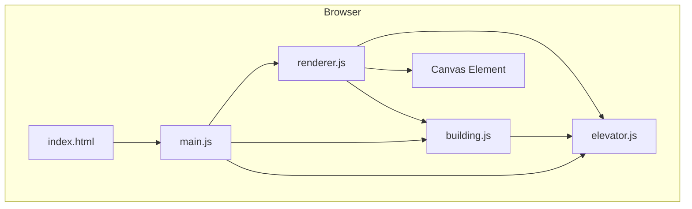
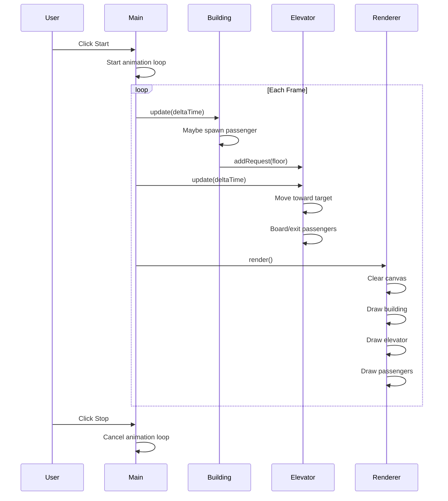
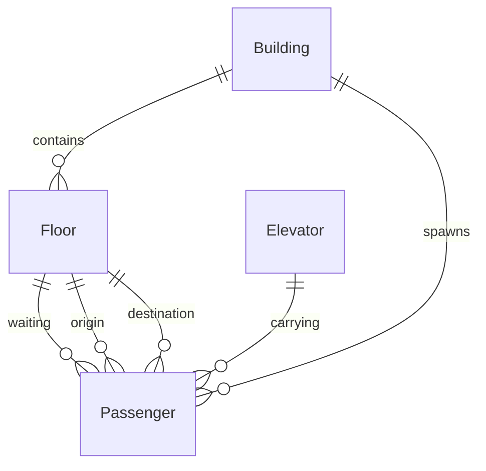

# Design Document: Elevator Simulator

## Overview

**Purpose**: This feature delivers an interactive elevator simulation to users who want to observe and understand elevator scheduling behavior.

**Users**: Anyone interested in simulation, elevator algorithms, or learning about scheduling systems.

**Impact**: Creates a new standalone browser application with no backend dependencies.

### Goals
- Visualize a 5-floor building with one elevator
- Demonstrate FCFS (First Come First Serve) scheduling
- Provide interactive start/stop controls
- Smooth animation at 60fps using Canvas API

### Non-Goals
- Multiple elevators (future extension)
- Advanced scheduling algorithms (future extension)
- Statistics collection (future extension)
- Backend integration
- Mobile-optimized layout

## Architecture

### Architecture Pattern & Boundary Map



**Architecture Integration**:
- **Selected pattern**: Simple module architecture with clear separation of concerns
- **Domain boundaries**: Building owns passengers and floors; Elevator owns movement and queue; Renderer owns visualization
- **New components rationale**: Each module maps to a distinct domain concept from requirements

### Technology Stack

| Layer | Choice / Version | Role in Feature | Notes |
|-------|------------------|-----------------|-------|
| Frontend | Vanilla JavaScript (ES6+) | Application logic | No framework per project constraint |
| Rendering | Canvas API | 2D visualization | Native browser API |
| Animation | requestAnimationFrame | Simulation loop | 60fps, auto-pauses on tab switch |
| Styling | CSS3 | Basic layout | Minimal styling for canvas container |

## System Flows

### Main Simulation Loop



## Requirements Traceability

| Requirement | Summary | Components | Interfaces | Flows |
|-------------|---------|------------|------------|-------|
| 1.1, 1.2, 1.3 | Building display | Building, Renderer | Building.floors | Render loop |
| 2.1, 2.2, 2.3, 2.4 | Elevator movement | Elevator, Renderer | Elevator.update(), Elevator.position | Simulation loop |
| 3.1, 3.2, 3.3 | Passenger spawning | Building, Passenger | Building.update(), Passenger | Simulation loop |
| 4.1, 4.2, 4.3, 4.4 | Boarding/exiting | Elevator, Building | Elevator.board(), Elevator.exit() | Simulation loop |
| 5.1, 5.2, 5.3, 5.4 | FCFS scheduling | Elevator | Elevator.queue, Elevator.addRequest() | Simulation loop |
| 6.1, 6.2, 6.3, 6.4, 6.5 | Canvas visualization | Renderer | Renderer.render() | Render loop |
| 7.1, 7.2, 7.3, 7.4, 7.5, 7.6 | Simulation control | Main | startSimulation(), stopSimulation() | User interaction |

## Components and Interfaces

| Component | Domain/Layer | Intent | Req Coverage | Key Dependencies | Contracts |
|-----------|--------------|--------|--------------|------------------|-----------|
| Main | Application | Simulation loop and UI control | 7.1-7.6 | Building, Elevator, Renderer (P0) | State |
| Building | Domain | Floor structure and passenger management | 1.1-1.3, 3.1-3.3 | Elevator (P1) | Service |
| Elevator | Domain | Movement and FCFS queue | 2.1-2.4, 4.1-4.4, 5.1-5.4 | None | Service, State |
| Renderer | Presentation | Canvas drawing | 6.1-6.5 | Building (P0), Elevator (P0) | Service |
| Passenger | Domain | Individual passenger data | 3.2, 4.3 | None | — |

### Domain Layer

#### Building

| Field | Detail |
|-------|--------|
| Intent | Manage floors and spawn passengers |
| Requirements | 1.1, 1.2, 1.3, 3.1, 3.2, 3.3 |

**Responsibilities & Constraints**
- Owns floor count and floor data
- Spawns passengers at random intervals
- Maintains list of waiting passengers per floor

**Dependencies**
- Outbound: Elevator — notify of new requests (P1)

**Contracts**: Service [x] / State [x]

##### Service Interface
```javascript
class Building {
  constructor(floorCount)
  update(deltaTime)           // Potentially spawn passengers
  getWaitingPassengers(floor) // Get passengers waiting on a floor
  removePassenger(passenger)  // Remove passenger when boarding
}
```

##### State
```javascript
{
  floorCount: number,           // 5
  floors: Floor[],              // Array of floor objects
  waitingPassengers: Map<floor, Passenger[]>
}
```

#### Elevator

| Field | Detail |
|-------|--------|
| Intent | Handle movement, boarding, and FCFS queue |
| Requirements | 2.1, 2.2, 2.3, 2.4, 4.1, 4.2, 4.3, 4.4, 5.1, 5.2, 5.3, 5.4 |

**Responsibilities & Constraints**
- Owns position and movement state
- Owns FCFS request queue
- Handles passenger boarding and exiting
- Moves at constant speed between floors

**Dependencies**
- Inbound: Building — receives floor requests (P1)
- Inbound: Main — update calls (P0)

**Contracts**: Service [x] / State [x]

##### Service Interface
```javascript
class Elevator {
  constructor(floorCount)
  update(deltaTime, building)  // Move and handle passengers
  addRequest(floor)            // Add floor to FCFS queue
  getCurrentFloor()            // Get current floor (integer when stopped)
  getPosition()                // Get exact Y position for rendering
  getPassengers()              // Get passengers inside elevator
  isMoving()                   // Check if elevator is in motion
  isDoorOpen()                 // Check if doors are open at floor
}
```

##### State
```javascript
{
  position: number,            // Current Y position (0-4 continuous)
  targetFloor: number | null,  // Current destination
  queue: number[],             // FCFS queue of floor requests
  passengers: Passenger[],     // Passengers inside elevator
  doorOpen: boolean,           // Door state
  speed: number                // Floors per second
}
```

#### Passenger

| Field | Detail |
|-------|--------|
| Intent | Represent individual passenger with origin and destination |
| Requirements | 3.2, 4.3 |

**Responsibilities & Constraints**
- Immutable data object
- Stores origin floor, destination floor, and visual identifier

**Contracts**: — (data object only)

##### Data Structure
```javascript
{
  id: number,
  originFloor: number,
  destinationFloor: number,
  color: string                // For visual distinction
}
```

### Presentation Layer

#### Renderer

| Field | Detail |
|-------|--------|
| Intent | Draw all simulation elements on canvas |
| Requirements | 6.1, 6.2, 6.3, 6.4, 6.5 |

**Responsibilities & Constraints**
- Owns canvas context
- Renders building structure, elevator, and passengers
- Clear and redraw each frame

**Dependencies**
- Inbound: Main — render calls (P0)
- External: Building — read state for rendering (P0)
- External: Elevator — read state for rendering (P0)

**Contracts**: Service [x]

##### Service Interface
```javascript
class Renderer {
  constructor(canvas, building, elevator)
  render()                     // Draw current state to canvas
}
```

**Implementation Notes**
- Draw order: background → floors → shaft → elevator → passengers
- Waiting passengers as dots to left of shaft
- Passengers in elevator as dots inside cabin rectangle
- Floor numbers displayed beside each floor

### Application Layer

#### Main

| Field | Detail |
|-------|--------|
| Intent | Initialize simulation and control loop |
| Requirements | 7.1, 7.2, 7.3, 7.4, 7.5, 7.6 |

**Responsibilities & Constraints**
- Initialize Building, Elevator, Renderer
- Manage running state (paused/running)
- Handle Start/Stop button clicks
- Run animation loop with requestAnimationFrame

**Dependencies**
- Outbound: Building, Elevator, Renderer — orchestration (P0)

**Contracts**: State [x]

##### State
```javascript
{
  isRunning: boolean,
  animationFrameId: number | null,
  lastTimestamp: number
}
```

##### Control Flow
```javascript
// Initialization
const building = new Building(5)
const elevator = new Elevator(5)
const renderer = new Renderer(canvas, building, elevator)

// Animation loop
function gameLoop(timestamp) {
  const deltaTime = timestamp - lastTimestamp
  lastTimestamp = timestamp

  building.update(deltaTime)
  elevator.update(deltaTime, building)
  renderer.render()

  if (isRunning) {
    animationFrameId = requestAnimationFrame(gameLoop)
  }
}

// Controls
function start() { isRunning = true; requestAnimationFrame(gameLoop) }
function stop() { isRunning = false; cancelAnimationFrame(animationFrameId) }
```

## Data Models

### Domain Model



**Entities**:
- Building: aggregate root for floors and spawning
- Elevator: aggregate root for movement and queue
- Passenger: entity with origin/destination

**Value Objects**:
- Floor: floor number and visual position

**Business Rules**:
- Passenger destination must differ from origin
- Elevator processes queue in FCFS order
- One passenger boarding/exiting per door-open period

## Error Handling

### Error Strategy
Client-side simulation with no external dependencies - errors are limited to initialization failures.

### Error Categories
- **Canvas unavailable**: Display fallback message if Canvas API not supported
- **Animation frame unavailable**: Fall back to setInterval (unlikely in modern browsers)

## Testing Strategy

### Unit Tests
- Building.update() spawns passengers at expected rate
- Elevator.addRequest() maintains FCFS order
- Elevator.update() moves toward target correctly
- Passenger creation ensures different origin/destination

### Integration Tests
- Full simulation loop processes passengers end-to-end
- Start/stop controls properly pause and resume
- Passengers board and exit at correct floors

### Manual Testing
- Visual verification of smooth animation
- Confirm passengers display correctly at floors and in elevator
- Verify floor numbers are readable
